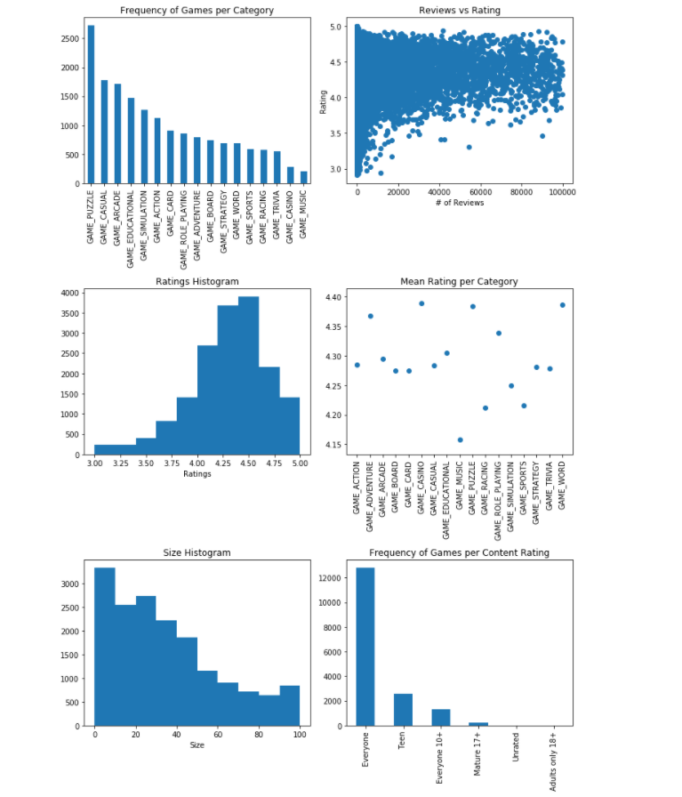
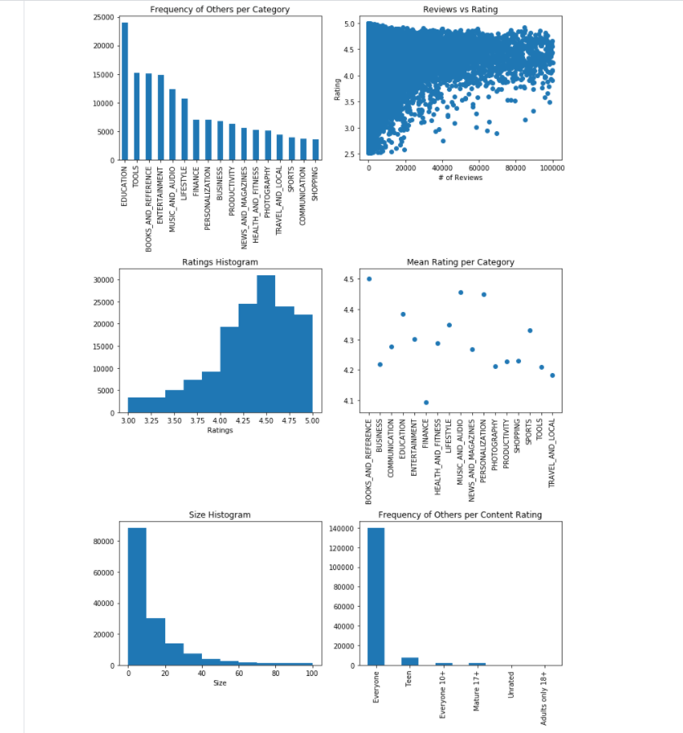
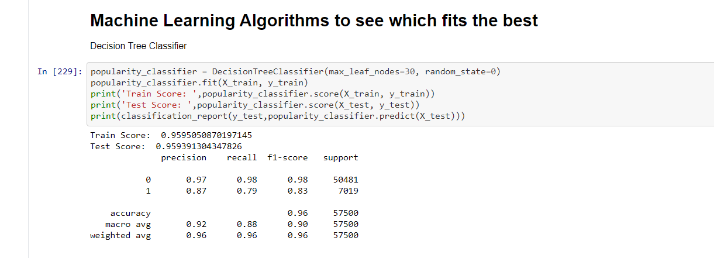

# Google-App-Success-Prediction
<h2>Created models using data of 267052 apps to determine success of app and general analysis</h2>
<h2>Accuracy of 95% with <b>Decision Tree Classifier</b></h2>

<h1>Analysis</h1>
<h2>GAMES</h2>

  
  

<h3>Things we can conclude from above charts</h3>

 -Puzzles category in games have more demand with higher ratings too.  
 -Casino and cards have lesser apps but high rating. 
 -Size varies a lot in games unlike in apps with majority being in 0-20 MB. 
 -Unlike what we presumed Teen are not the one being targeted but people with all age group. 5.Reviews are generally given for apps with higher rating. 

<h2>APPS</h2>

  
  

<h3>Things we can conclude from above charts</h3>

 -Apps in category of Education,Tools,Entertainment,Books and Reference are present in heavy numbers their average rating is also better than rest of categories. 
 -Apps in categories communication,Travel,Finance are in lower numbers with their average rating being low too. 
 -Apps in category of Finance has low no of apps and lowest average rating which means that people have more demand in Finance and the apps lack in providing the comfort. 
 -Reviews are generally given for apps with higher rating. 5.Apps generally appeal all kind of age group. 
 
<h2>Decision Tree Classifier Model</h2>

  
  

